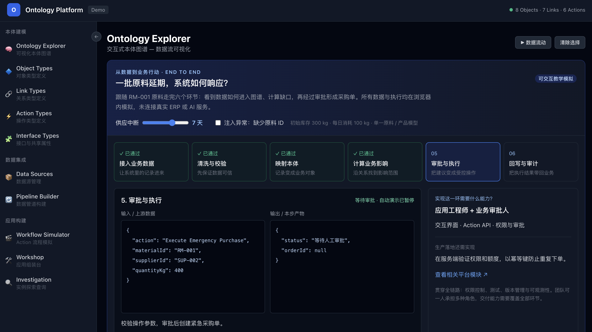

# Ontology Platform · 本体智能教学平台

**从一批原料延期，看懂数据如何变成业务行动。**

一个围绕医疗供应链场景构建的交互式学习项目。通过可视化本体图谱与端到端演示，理解对象、关系和操作如何连接业务数据，也看清把这套系统落地需要哪些技术能力。

**8 类业务对象 · 7 类关系 · 6 类操作 · 6 阶段端到端演示**

[快速开始](#快速开始) · [体验一次业务闭环](#体验一次业务闭环) · [技术能力拆解](#技术能力拆解) · [课程与学习材料](#课程与学习材料)



*同一条业务链路，同时看见处理进度、输入输出，以及每一步背后的工程能力。图中演示停在审批环节，等待人工确认后继续。*

## 为什么做这个项目

“本体”听起来抽象，真正理解它，可以从几个具体问题开始：

- 供应商通知原料延期，系统如何知道哪些产品会受影响？
- 库存记录如何变成可以查询、关联和操作的业务对象？
- 一个补货建议，如何经过校验、审批，最终形成采购单？
- 数据工程、领域建模、应用开发和系统集成，分别负责什么？

本项目源于《AI 本体论与共享模型》课程研究，参考 Palantir Ontology 的产品概念，以 Onyx 医疗供应链为教学背景，把这些问题放进可以操作的界面中。适合初次接触本体的开发者、需要理解落地范围的产品与业务团队，也可用于课堂讲解与团队分享。

## 体验一次业务闭环

打开首页，点击 **「自动演示」**，跟随原料 `RM-001` 走完六个环节；也可以暂停、单步查看或重新开始。

```text
接入业务数据 → 清洗与校验 → 映射本体 → 计算业务影响 → 审批与执行 → 回写与审计
```

试试下面三个实验，观察输入变化如何影响后续决策：

| 你可以这样操作 | 页面会发生什么 | 你会理解什么 |
| --- | --- | --- |
| 保持中断 7 天，推进演示 | 库存 300 kg、日消耗 100 kg，计算出 400 kg 缺口；流程停在模拟审批 | 从业务规则到受控操作的衔接 |
| 将中断时间调到 3 天以内 | 缺口为 0，不创建采购单，进入持续监控 | 决策应随数据变化，而不是固定播放一个结果 |
| 勾选「缺少原料 ID」 | 校验失败，阻止进入下一步；补齐后才能继续 | 数据质量与实体标识为什么是建模的前提 |

审批通过后，演示生成模拟采购单、回写回执与决策日志。**下单不等于到货**：库存不会立即增加，中断仍需持续跟踪。

## 技术能力拆解

每个阶段都展示输入、输出、负责角色和生产落地要求，并联动高亮下方本体图谱中的相关对象与关系。

| 环节 | 核心能力 | 交付结果 |
| --- | --- | --- |
| 接入业务数据 | API / SQL、增量同步、数据契约 | 带来源与稳定标识的业务数据 |
| 清洗与校验 | ETL、单位标准化、主键与外键校验 | 可用的标准数据与异常隔离记录 |
| 映射本体 | 领域建模、实体标识、关系与基数约束 | 可关联的对象实例 |
| 计算业务影响 | 关系查询、业务规则、可解释计算 | 影响范围、补货缺口与计算依据 |
| 审批与执行 | 应用交互、Action API、权限与审批 | 经授权的业务操作 |
| 回写与审计 | 系统集成、状态同步、审计与监控 | 执行回执与可追溯的决策记录 |

这些能力可以由不同角色协作完成，也可以由同一人承担多个角色。生产实现还需要覆盖版本管理、测试、服务端授权、幂等、失败重试和对账。

## 继续探索平台

围绕同一个业务场景，从模型定义走到数据集成与应用交互。

| 方向 | 模块 | 体验内容 | 页面路径 |
| --- | --- | --- | --- |
| 全链路体验 | Ontology Explorer | 六阶段演示、对象详情、关系图谱与路径追踪 | `/` |
| 本体建模 | Object Types | 对象属性与主键配置 | `/ontology/objects` |
| 本体建模 | Link Types | 关系类型、基数约束与关系矩阵 | `/ontology/links` |
| 本体建模 | Action Types | 操作参数、审批要求与执行效果 | `/ontology/actions` |
| 本体建模 | Interface Types | 共享属性契约与对象实现 | `/ontology/interfaces` |
| 数据集成 | Data Sources | 数据源与同步状态展示 | `/data/sources` |
| 数据集成 | Pipeline Builder | 可视化数据管道与 ETL 配置 | `/data/pipelines` |
| 应用构建 | Workflow Simulator | Action 流程模拟 | `/apps/workflow` |
| 应用构建 | Workshop | 应用组件组装与配置 | `/apps/workshop` |
| 应用构建 | Investigation | 实例查询与关联探索 | `/apps/investigation` |

示例模型包含原料、供应商、采购单、产线、产品、物料清单、供应中断和决策日志八类对象，贯穿「数据 → 模型 → 决策 → 行动」的学习过程。

## 快速开始

需要本地安装 Node.js（18.17 或更高版本）与 npm。在项目根目录执行：

```bash
npm install
npm run dev
```

浏览器打开 `http://localhost:3000`，从首页的端到端演示开始。无需配置数据库、业务系统账号或 AI API Key。

构建并运行生产版本：

```bash
npm run build
npm start
```

开发模式使用 `.next-dev/`，生产构建与启动使用 `.next/`，避免运行开发服务时执行构建覆盖热更新产物。

项目使用 **Next.js 14 App Router、React 18、TypeScript、Tailwind CSS 和 SVG**。业务演示运行在浏览器中，页面通过 Next.js 服务提供。

## 课程与学习材料

建议先体验演示，再结合教材理解概念与设计取舍。

| 学习主题 | 材料 |
| --- | --- |
| 完整课程 | [AI 本体论与共享模型](textbook/palantir-ontology-course.md) |
| 核心概念 | [本体概念与边界](materials/section1/ontology-core-concepts-notes.md) |
| 共享模型 | [语义契约与协同](materials/section2/shared-model-notes.md) |
| 产品设计 | [Palantir Ontology 设计笔记](materials/section3/palantir-ontology-design-notes.md) |
| 落地实施 | [实施路径与能力建设](materials/section4/implementation-notes.md) |
| 教学与练习 | [讲师手册](textbook/讲师手册.md) · [案例库](textbook/案例库.md) · [练习题集](textbook/练习题集.md) · [作业集](textbook/作业集.md) |

## 项目结构

```text
src/
├── app/                    # 首页、本体建模、数据集成与应用页面
├── components/
│   ├── OntologyJourney.tsx  # 六阶段端到端教学演示
│   └── Layout.tsx          # 导航与页面布局
└── data/
    └── ontology-model.ts   # 对象、关系、操作与接口定义
textbook/                   # 完整课程、案例与练习
materials/                  # 四节课程的研究笔记
refs/                       # 参考资料
docs/                      # 项目文档与介绍截图
```

## 演示范围

本项目用于学习与教学演示，是对相关产品概念的独立学习实现，非 Palantir 官方产品。

当前数据、审批、采购、回写和审计均为前端模拟，未连接真实 ERP、数据源或 AI 服务。首页演示使用单一原料 / 产品的简化模型与固定示例 ID，刷新页面会清除演示状态。界面中的生产落地要求用于说明后续建设范围，不代表这些后端能力已经实现。
